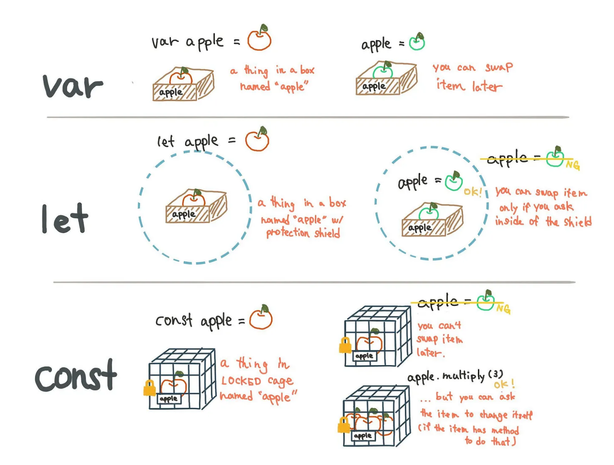

# javascript-examples

## Table of contents

# JavaScript topics

    - Declarations/hoisting/variable scopes/shadowing
    - Recursion/LexicalScope/Closure
    - JavaScript Errors: Syntax errors, Runtime errors, Logic errors, and error handling
    - Loops and functions in javascript
    - Array and its methods.
    - JavaScript Objects: Creating objects, object properties, and object methods, Prototypes.
    - Function Declaration,Expression,Arrow function,callbacks first class and Higher order function.
    - JavaScript Regular Expression
    - String and its methods
    - JavaScript Classes: Defining classes, constructor functions, and inheritance.
    - callbacks,promises and async/await.
    - Event Loop and Callback Queue in JavaScript.
    - JavaScript JSON: Parsing and serializing JSON data.
    - Commonly used JavaScript Libraries and Frameworks.
    - JavaScript Best Practices: Coding standards, naming conventions, and style guides.
    - Event Loop and Callback Queue in JavaScript.
    - Modules in JavaScript.
    - call by value and call by reference.

## Promises

Promises are used to find out if an operation is successfully completed or not.

- It basically has three states:
  - Pending =>
  - Fulfilled => .then(onFulfillment)
  - Rejected=> .catch(onRejection)
- Using a promise:
  - .then() block: used with callback when the promise is successfully resolved.
  - .catch() block: used with callback when the promise is rejected.
  - .finally() block: method gets executes irrespective if promise is resolved/rejected.

# Object Oriented Programming

In OOPS we group function and variable in a block called class.

- Four pillars:
  - Inheritance: Subclass(i.e. child class) acquiring properties of parent class(i.e. base class/super class)
  - Polymorphism: Many Forms/Same function name but different functionalities.
  - Encapsulation: Wrapping up of data and member function into single unit.
  - Data abstraction: Process of showing essential.necessary features and hide irrelevant data.

## Regular Expression

**Regular Expression are used to perform pattern-matching and search-and-replace function text.**

    - [abc] : a,b or c
    - [^abc] : any character except a,b,c
    - [A-Za-z] : A to Z, a to z \* [0-9] : 0 to 9

- Quantifiers
  - [ ]? : occurs 0 or 1 time
  - [ ]+ : occurs 1 or more time
  - [ ]\* : occurs 0 or more time.
  - [ ]{n} : occurs n time.
  - [ ]{n,} : occurs n or more time
  - [ ]{y,z} : occurs atleast y time, but less than z time.
- Regex meta characters:
  - \d [0-9]
  - \D [^0-9]
  - \w [a-zA-Z0-9]
  - \W [^\w]

## var vs let vs const

- var: function-scoped and can be updated and redeclared.

- let: block-scoped, can be updated, but cannot be redeclared.

- const: block-scoped, cannot be updated and redeclared.

  

# Creating a Repository on Git.

    - open VScode,create a folder,open terminal and type the 'git init' command to start a repository.

**Getting started with Git commands**

    - git status // will return the status of the file(tracked,untracked,ready to commit etc)
    - git add <file name>  // Moves file to staging are making it ready for next commit.
    - git commit -m "message for change" //will save all the file changes locally making it ready to push to remote.
    - git push //will push all files to remote branch(i.e. GitHub)

**Creating a branch on Git**

> Creating a new branch will copy all files from existing branch to **new branch**.

    - git branch <branch name>
    - git checkout <branch name> //To switch to new branch

**Making a Pull Request**

> As soon as you push to remote,on the github page you will find an option to open a **Pull Request (PR)**

    - Click on the option to open PR.
    - You can add reviewer to review work done.
    - If you add reviewer,the person will be notified for the same.
    - Review suggestion will be made if any and finally you can merge the branch to main when approved.

**Code Review Process**

    - If you have received suggestions to make change,there may be option to 'commit change' for some changes.
    - You can commit the changes itself there and take a pull locally.(The changes which were remote will also be made locally).
    - And that remaining changes can be made locally and then pushed again.
    - After pushing,the reviewer will be notified about changes.
    - If approved, then merge it with main else repeat the review process.

**Resolving fetch/pull query locally.**

    - Let's say you created test2 branch from the main branch

    - Reviewer has comments after you push.But at the same time you also start another test2 from the main branch(i.e before merging)

    - Now test1 branch is merged to main.Now you need to take the fetch/pull from main for test2 branch (Because we need updated code in our branch)

**Note: Meanwhile you can stash changes on test2 and get back later.**

    - we need to create a merge commit.
    - on github desktop - we can come to the current branch where  we want the latest changes.
    - we have an option to choose a  branch to merge changes into the  current branch.

**Note: There maybe conflict because you maybe making manipulations to common file in both branches.**

    case 1: There is no conflict with the base branch.Hence, your pull is successful.

    case 2: Conflict arises,hence you can compare both files and select changes you like.

    Finally, you can comeback to current branch(i.e. test2) and fetch the stash.

## HTTP status codes:

    1XX : Informational Response.
    2XX : Successful Response
    3XX : Redirects
    4XX : Client Error
    5XX : Server Error

# HTTP Methods:

    - GET    : CREATE
    - POST   : READ
    - PUT    : UPDATE(Replace Complete Information)
    - PATCH  : UPDATE(Modify Partial Information)
    - DELETE : DELETE

# Tasks

- Program to prompt user for name and greet with message.
- Program to use array, sets and map to store and manipulate data.
- Declare variables of different data types and print them.
- Function accepts parameter and stores data using variable declaration.
- Calculate factorial of number using recursion.
- Program produces errors(i.e. syntax,logical,runtime) and then handling it(i.e. try,catch,finally).
- Program that takes number as input and prints positive, negative or zero.
- Program to create object and print its properties.
- Implementation of different kinds of functions(i.e. anonymous,arrow,function expression etc) within a single code.
- Creating a class circle and car and defining various properties and methods within.Accessing information by creating objects.
- Implementation of callbacks, promises, async-await in various examples.
- Program to take number(i.e. month 1-12) and returns the quarter in which the number lies.

# Mini-Projects:

- Building a Todo Application by using OOPs concept in JavaScript.
